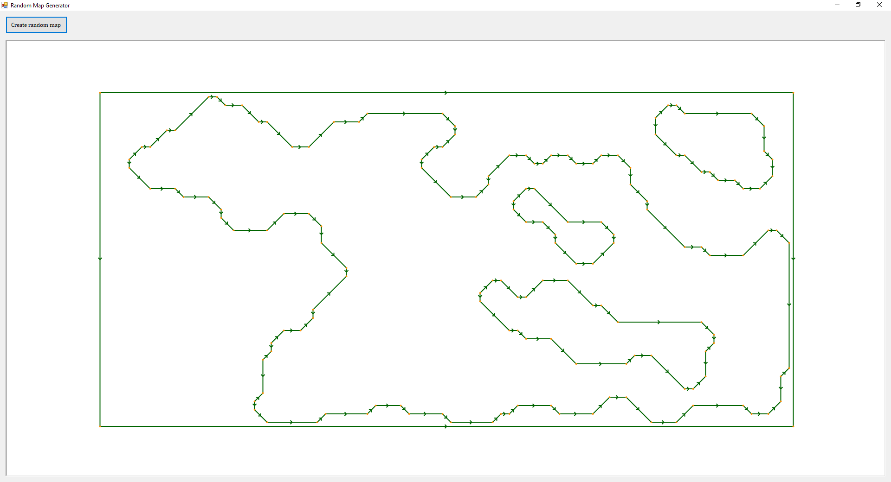
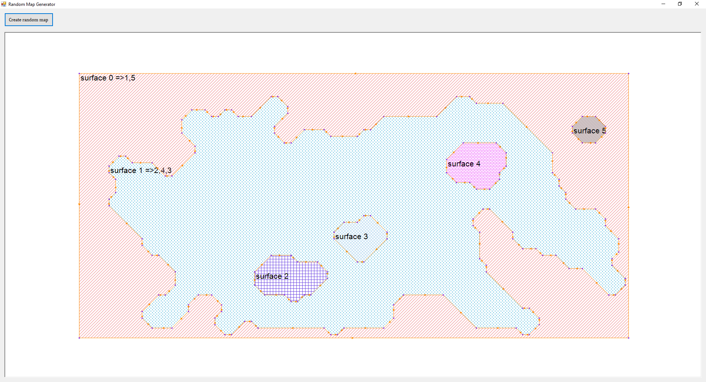
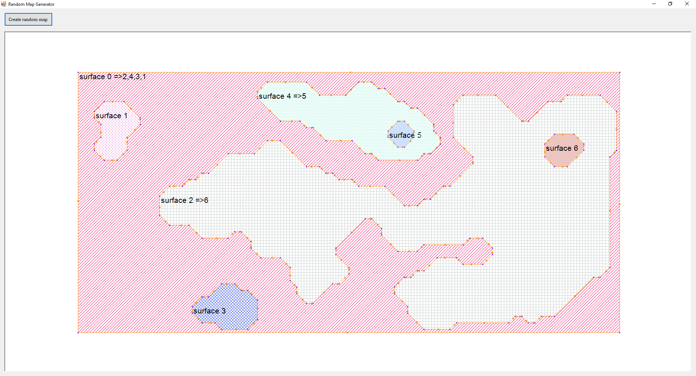
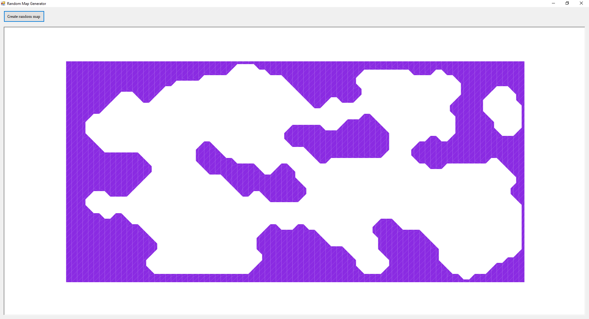

# Random domain generator
C# implementation of random closed domain generator. Closed domain is used in lot of math problems. 
  
This implementation is basically to test my constrained delaunay triangulation of Ruppert's algorithm and Paul Chew's second algorithm.  
A Random closed domain  
  
The surface of the domain is saved such that it also holds the inner surface details. For example, in the below example surface 1 encapsulates surface 2,3& 4, surface 2,3,4& 5 has no inner surfaces, finally surface 0 the outtermost surface encapsulates surface 1& 5.    
  
Below is the another example where surface 2 encapsulates surface 6, surface 4 encapsulates surface 5, surface 1,3,5& 6 has no inner surfaces, finally surface 0 the outtermost surface encapsulates surface 1,2,3& 4.  
  
All credits to https://forum.unity.com/threads/procedural-cave-generation.296986/
  
